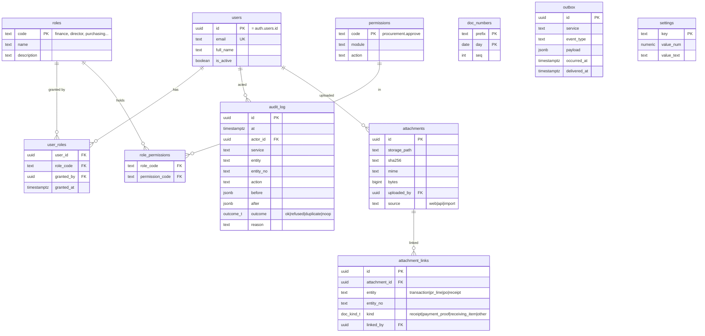
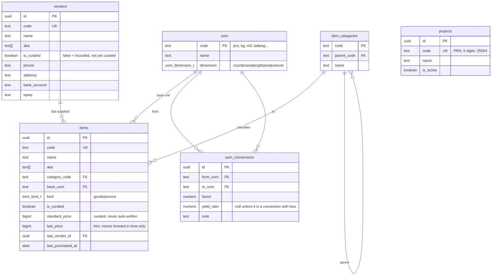
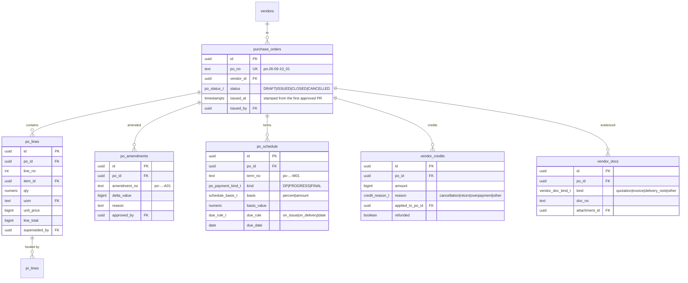
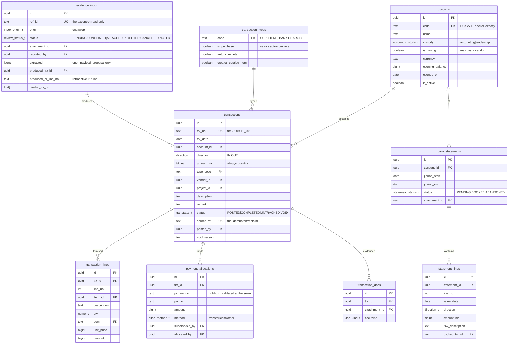

# 02 — Database

> **Phase note — nothing here is built yet.** This is the *target* schema.
> In Phase 1 it has exactly one job: it is the shape the demo types in
> `src/services/*/contracts.ts` are cut to, so column names, enums and
> relationships are already right when Phase 2 starts.
>
> **This document is expected to be wrong in places, and gets rewritten on
> D14** against what walking the workflow teaches us (`findings.md`). That is
> the point of doing the frontend first — a guess costs an edit here instead
> of a migration later. Do not treat it as settled.

New Supabase project (Phase 2). One database, one schema per service. Every table
ships with RLS in the migration that creates it (ADR-002).

## Conventions

| Thing | Rule |
|---|---|
| Primary keys | `uuid` `default gen_random_uuid()` for internal identity |
| Public identifiers | a separate `*_no` text column, `UNIQUE`, minted by `core.next_doc_number()` (ADR-005). This is what humans, URLs and other systems use |
| Money | `bigint`, whole rupiah, always positive. Direction is a separate `IN`/`OUT` column (as today, §3.4) |
| Quantities | `numeric(18,4)` — 0,001 m³ of a log is money (§ format.ts already assumes 3 decimals) |
| Time | `timestamptz`, always. The *office day* (WITA, `Asia/Makassar`) is derived where needed, never stored as a naked date except `trx_date` |
| Status | Postgres `ENUM` types, never text with a comment (D2) |
| Names | `snake_case`, domain words, **never a spreadsheet header** (D1). `amount_idr` not `idr_amount`; `direction` not `in_out` |
| Text search names | `name` plus `aka text[]` for absorbed spellings, as today (§3.7) |
| Append-only tables | `REVOKE UPDATE, DELETE`; corrections via a new row + `superseded_by uuid` |
| Every table | `created_at`, `created_by` (uuid → `core.users`) |
| Every business table | RLS enabled, policies referencing `core.has_permission()` |
| Deletes | not granted to anyone, anywhere. Corrections are VOID or supersession (A5) |

### The one function every policy calls

```sql
core.has_permission(permission_code text) returns boolean
-- reads auth.uid() -> core.user_roles -> core.role_permissions
-- STABLE, SECURITY DEFINER, search_path pinned
```

### Settings, so a tolerance has one home

`core.settings(key text pk, value_num numeric, value_text text, note text)`
seeded with `payment_tolerance_idr = 1000`, `statement_tolerance_idr = 0`,
`approval_tolerance = 0.01`, `office_timezone = 'Asia/Makassar'`.
Views read it. Nothing hardcodes a tolerance ever again (D3).

---

## Schema `core` — identity, audit, numbering, files



**Access is two separate things** (owner, 2026-09-11, answering Q2 and Q3).
Conflating them is what made "who may post?" invisible to the web app in
`john-lau`, where the button showed for anyone with `finance`, `director` or
`it_admin` and the bridge then returned 403 from an environment variable the
screen could not see (§3.3).

**1. Module access — what you can open.** A user holds *several*:
procurement + accounting + HRD is a normal combination, not an exception.

```sql
core.user_modules (user_id, module, level)
  module ∈ procurement · accounting · hrd · inventory · production · it
  level  ∈ read · write · admin
```

**Ledger visibility is exactly accounting-module access** — not "everyone
signed in", which is what `john-lau` does today.

**2. Authorities — a small set of named decision rights**, granted on their
own and never implied by a module level:

| Authority | Who, today | Guards |
|---|---|---|
| `approve_goods` | **CEO only** | every PR line decision. One authority, not "any director" |
| `approve_funds` | finance | approving and closing a payment round |
| `post_ledger` | finance | creating a transaction |
| `resolve_inbox` | finance | resolving an exception document |

An authority is a grant on a user, so the screen and the database read the
same fact and cannot disagree. A user without `approve_goods` does not see
the approve control **and** is refused by RLS if they call the API anyway.

**A tension that dissolves.** `john-lau` deliberately fused accounting and
procurement into one `finance` role, because "splitting it produces someone
who can approve a purchase without ever seeing the cash" (§6.3). Composable
module grants would bring that risk back — except that `approve_goods` now
belongs to the CEO alone, so the person approving purchases is not a module
grant at all. The safeguard is no longer needed in that shape.

`src/lib/roles.ts` remains the reviewable seed source (see `03-api.md`), but
what it seeds is this: modules, levels, and four authorities.

### Three trails, and only one of them is expensive to add late

The IT module needs to answer three different questions, and they are not one
table because they fail differently.

| Trail | Answers | Written by | Cost of adding it later |
|---|---|---|---|
| **`core.audit_log`** — changes | who changed what, from what, to what, and was it refused | the same transaction as the change itself | **High.** Not the table — the *seam*. Retrofitting means finding every write path and hoping none was missed |
| **session events** | who was in the system, when, and as whom | the identity service | Low. A handful of call sites, all in one service |
| **`core.activity_log`** — reads | who *looked at* the ledger, HR records, a salary | the request layer, gated and sampled | Low to add, but it is the one with a real policy question attached: how long is it kept, and who may read the log of who read what |

**Only the first has to be early**, and it is early for a reason that is not
about storage: an audit row written *after* the fact is a story, and an audit
row written in the same transaction is evidence. The rule — every mutation
writes its business rows and its audit row together or neither — is in the
definition of done and is enforced today across every write in the demo layer.

**Sessions are recorded from M2**, because a trail that cannot say who was
signed in cannot answer the first question anyone asks it.

**Reads are not logged yet, deliberately.** It is the only trail that grows
without bound, the only one that costs something on every request, and the only
one where retention is a policy the owner has to set rather than a default we
can pick (§10.2 q8 leaves exactly this open). It is a middleware concern, not a
schema one, so building it later costs a middleware and a table — not a hunt
through the codebase.

`core.audit_log` is append-only and has **no** hash chain in v1. §10.2 q8
records that the audit triggers were written and never run because they touch
money write paths; here they are in scope from the start, on the one write
seam only (ADR-006), which is the narrow path they should always have used.

---

## Schema `procure` — reference data, PR chain, PO

### Reference data



`uom_conversions` exists in v1 **as a table only** — procurement needs
`box → pcs`. The wood yield chain (log m³ → sawn boards at 45–60% → dried →
components with 10–30% offcut, README "what must be designed right from the
start") is the inventory milestone, and it plugs in here rather than needing
a new model. Stock is always stored in an item's `base_uom`.

`is_curated=false` keeps its exact `john-lau` meaning: **recorded, and
invisible in dropdowns and AI prompts until a human promotes it** (§3.7).
A new vendor typed by a human must always be accepted — that was the owner's
call on 2026-08-05 and it stands.

### PR chain

```mermaid
erDiagram
    pr_documents ||--o{ pr_lines : "contains"
    pr_lines ||--o{ pr_approvals : "decided"
    pr_lines ||--o{ pr_line_revisions : "superseded"
    pr_lines ||--o{ receipts : "received"
    vendors ||--o{ pr_lines : "from"
    items ||--o{ pr_lines : "of"
    payment_rounds ||--o{ payment_round_lines : "freezes"
    payment_rounds ||--o{ round_transfers : "funded by"
    pr_lines ||--o{ payment_round_lines : "in"
    pr_lines ||--o{ line_settlements : "short settled"
    pr_lines ||--o{ line_variances : "explained"
    pr_lines ||--o{ line_notes : "annotated"
    pr_lines ||--o{ approval_requests : "asked"
    approval_batches ||--o{ approval_requests : "sent in"

    pr_documents {
        uuid id PK
        text doc_no UK "pr-26-09-10_01"
        pr_doc_type_t doc_type "PR|FUND"
        pr_doc_status_t status "DRAFT|SUBMITTED|APPROVED|CLOSED|CANCELLED"
        uuid requested_by FK
        uuid project_id FK
        text purpose
        timestamptz submitted_at
    }
    pr_lines {
        uuid id PK
        uuid doc_id FK
        int line_no "-> pr-26-09-10_01-L03"
        text line_no_full UK "generated column"
        uuid item_id FK
        text description "what the requester actually wrote"
        numeric qty
        text uom FK
        bigint unit_price
        bigint item_total "what was ASKED. never zeroed to cancel"
        uuid vendor_id FK
        uuid po_line_id FK "null unless funding a PO"
        text category "RAW MATERIAL|MACHINING|..."
        date need_by
        timestamptz removed_at "withdrawn by the requester"
        uuid removed_by FK
    }
    pr_approvals {
        uuid id PK
        uuid line_id FK
        approval_step_t step "GOODS|FUNDS"
        boolean approved "checked, or not yet"
        numeric approved_qty
        bigint approved_amount "CHECK not above item_total"
        uuid recorded_by FK
        channel_t channel "web|chat|sheet|script|api"
        text reason
        timestamptz recorded_at
    }
    payment_rounds {
        uuid id PK
        text round_no UK "pay-26-09-10_01"
        round_status_t status "OPEN|APPROVED|TRANSFERRED|CLOSED"
        uuid approved_by FK
        bigint transferred_amount
        text transferred_trx_no
        uuid closed_by FK
        timestamptz closed_at
    }
    round_transfers {
        uuid id PK
        uuid round_id FK
        bigint amount
        text trx_no "the ledger row that moved it"
        uuid proof_attachment_id FK "no proof, no transfer"
        uuid recorded_by FK
        timestamptz recorded_at
    }
    payment_round_lines {
        uuid id PK
        uuid round_id FK
        uuid line_id FK
        bigint requested_amount "frozen at APPROVE ROUND"
    }
    receipts {
        uuid id PK
        text receipt_no UK
        uuid line_id FK "exactly one of line_id/po_line_id"
        uuid po_line_id FK
        numeric qty_received
        receipt_condition_t condition
        uuid received_by FK
        uuid qc_by FK
        timestamptz received_at
    }
    line_settlements {
        uuid id PK
        uuid line_id FK
        bigint shortfall
        text reason "NOT NULL. a named human decision"
        uuid decided_by FK
    }
    line_notes {
        uuid id PK
        uuid line_id FK
        text instructions "something to DO"
        text remark "for the record"
        uuid recorded_by FK
        timestamptz recorded_at
    }
    approval_batches {
        uuid id PK
        text batch_no UK "ask-26-09-10_01"
        text token UK "random, never derived"
        uuid sent_to FK
        uuid sent_by FK
        channel_t channel
        timestamptz sent_at
    }
    approval_requests {
        uuid id PK
        uuid batch_id FK
        uuid line_id FK
        text token UK "identifies the REQUEST, never a person"
        uuid sent_to FK "whose yes this is"
        uuid sent_by FK "who chased it"
        channel_t channel "chat"
        timestamptz answered_at
        text outcome "approved|declined|null"
    }
    line_variances {
        uuid id PK
        uuid line_id FK
        variance_reason_t reason "closed list of seven"
        text note "required when reason = other"
        bigint amount_at_time "the gap when it was explained"
        uuid recorded_by FK
        timestamptz recorded_at
    }
```



**`round_transfers` — no proof, no transfer, and rarely only one** (D80, D82).
A round reaches TRANSFERRED on its first instalment and keeps taking more
until it is fully funded; each row carries its own amount, its own ledger row
and its own proof, because each is its own claim about the bank. A single
`transferred_amount` column on the round could hold only the last transfer, or
a total nobody could take apart. "Transferred" is a
claim about the bank, and the sheet's version of that claim was a tick
somebody typed — which is exactly how a round could read funded while the
money was still sitting in the leadership account. The same rule already
governs receiving: no photo, no receipt (A15).

The proof also lives where it belongs, on the transaction that received the
money (`attachment_links`, `entity: transaction`, kind `Payment Proof`), so
the ledger row reads correctly on its own. The round holds the id; the
filename is the documents service's business.

**`evidence_inbox.money_direction` — the second road in** (D81). Almost
everything in that inbox is somebody who bought first: money going OUT. A
transfer proof dropped in chat by leadership is money coming IN, and it is
resolved by a different person for a different reason — booked as a receipt
into BCA 271 rather than matched to a purchase. Confirming one writes the IN
transaction, files the same photo against it, and closes the inbox row with a
pointer to what it produced.

**`line_notes` — leadership's two optional fields** (D64). `instructions` is
something the requester is expected to DO; `remark` is for the record. They
are not columns on `pr_approvals` because the moment they earn their keep is
on a line nobody has decided yet: "get another quote before you order this" is
an instruction, and making somebody approve the line before they can say it
would be backwards.

**`approval_requests` — the yes that leaves the room** (D69). A leadership
meeting runs on one laptop, open on whoever's account. Ticking the box there
records that person as the approver, which is false — and false in the one
place the system exists to be trustworthy. So the line is sent to the
approver in Google Chat, and the answer comes back carrying **their**
identity.

Two columns carry the rule. `sent_to` is whose decision it is; `sent_by` is
who chased it, which is a different question worth keeping. `token`
identifies the request and never the person: in Phase 2 the answer arrives as
a signed webhook from Google and the identity is read from that signature, so
a token that carried an identity would be a password anybody who saw the card
could replay.

The resulting `pr_approvals` row reads `chat · evin@talaliving.com · 14:00`,
which is what actually happened.

**Batched, because a meeting is a list** (D70). One send is one
`approval_batches` row and one card, carrying every line in it and three
totals: asked for, approved so far, and what has to be paid — that last one
being approved *minus what already reached those lines*, since approving
something already paid for commits no new money. Fifteen separate cards would
ask the approver to add fifteen numbers up before knowing what they had just
committed to.

`token` is random on both tables and never derived from `batch_no`: it is a
capability the card carries back, so a predictable one would let anybody who
can guess a document number answer somebody else's list.

**`line_variances` — why the money that moved is not the money approved**
(D54, D55). Append-only, like every decision record here: a correction is a new
row beside the old one, never an edit. Three columns carry the weight.

`reason` is an enum of seven and never free text, because the value of this
table is *counting kinds*. `price_changed`, `quantity_changed`, `rounding`,
`input_error`, `partial_payment`, `overpaid`, `other` — and `other` requires
`note`, refused with 422 otherwise.

There is **no `fault` or `blamed_on` column, deliberately.** Whether one
Rp 225.000 gap was a typo or carelessness is not knowable from the data, and a
column that claims to know gets believed. What is knowable is the shape of the
pile: twelve `price_changed` against one vendor, six `input_error` from one
person.

`amount_at_time` freezes the gap as it stood when somebody explained it, so a
later payment on the same line does not silently rewrite what was being
explained.

**The link to `line_settlements`** (D56): an underpayment explained as anything
except `partial_payment` writes a settlement row in the same transaction, with
the explanation as its `reason`. A12 asked for a shortfall to close by a named
human decision — this is that decision, so it is one act.

**Approval is a checkbox** (D28). `pr_approvals` keeps its append-only shape
and its identity columns — a toggle writes a row, so "approved at 14:02, then
un-approved at 14:09" survives — but the vocabulary is two states, not three.
The approved amount is a separate thing from the decision: it defaults to what
was requested and may be **reduced before checking**, never raised (A8).

**Removal, and the one guard it needs** (D29). A line is removed because it is
no longer needed — there is no deadline and nothing ages out. Soft: the row
stays, with `removed_by` and `removed_at`, and a removed line can never be
paid, which is the guarantee `REJECTED` used to carry.

The guard: **a line cannot be removed once money has reached it.** Removal is
for something not yet bought. Once an allocation exists, the right words are
return, vendor credit, or a void on the transaction — never a quiet
disappearance (A17, A18). Removing a line that sits in an `OPEN` round pulls
it out of that round; a round already `APPROVED` has frozen its numbers, so
the line leaves the queue but the round's record does not change.

### PO



**PO rules held by the schema** (§3.9):

- `contract_value` = Σ non-superseded `po_lines.line_total` — a view, never
  a column.
- A PO is born `DRAFT` and becomes `ISSUED` only when the first PR line
  pointing at it is approved. After that the obligation moves **only** through
  an approved `po_amendments` row.
- One `DP` and one `FINAL` per PO (partial unique index); `PROGRESS`
  unlimited.
- A write-back that would cut a line's qty below what has already been
  received is refused — that is a return/credit decision, not an edit.
- No separate PO approval surface, and no second money path: a PO is funded
  by PR lines that carry its `po_line_id`, and those ride the weekly round.

---

## Schema `acct` — accounts, ledger, allocations, review



Note what is **not** here: no `sheet_ref`, no `push_id`, no `pushes` table, no
`trx_ids` reservation table, no `queue_writes`. All four exist in `john-lau`
only to keep a spreadsheet and a database in step (D1, ADR-006).

Note also what has **shrunk**: the review queue is now `evidence_inbox` and
carries only the exception road (ADR-010). It has no slot naming, no candidate
line picker and no `duplicate_of_event`, because those existed to support a
guess that no longer has to be made.

`statement_lines` is a real table, not `interpretations.output.rows` — §9.3.7
names that JSON blob as the only home statement lines had, which is why they
could not be queried.

`transaction_types.auto_complete` ships **inert** (Q9). Fuel and utility rows
will never receive goods and should be born `COMPLETED`, and `john-lau`
already encodes exactly that — but the owner's call is to complete them by
hand for now and turn the rule on once we have watched which types really
never get a delivery. The column exists so that switch is a data change.

---

## Evidence: the main road and the exception road

ADR-010 inverts how a document reaches the system, and the schema has to make
the normal case the cheap one.

**The main road — `core.attachment_links`.** Somebody opens a PR line or a
ledger row and attaches a file there. One insert into `core.attachments`, one
into `core.attachment_links` naming the entity, done. No queue, no extraction
step standing between the upload and the link, no status to resolve.

The link table is **many-to-many from the first migration**, not as a fix:

- one receipt covering three ledger rows is three link rows, added by
  attaching from the first and then choosing *also covers…*
- one ledger row carrying a receipt, a payment proof and a receiving photo is
  three link rows with different `kind`
- a document is never *moved* from one parent to another — a wrong link is
  removed and a right one added, and both are in the audit log

This is what makes tracing work: every link row records **who** declared it
and **when**, which the old model could not, because the linkage was inferred
rather than stated.

**The exception road — `acct.evidence_inbox`.** A document whose parent is
genuinely unknown: bought first, approved later. It arrives from Chat (the
buyer has no web access) or from the web, gets an AI reading as a *proposal*,
and waits for a person to resolve it into one of: a new transaction, a
retroactive PR line, a link to something that already exists, a personal note
(`Others`), or a rejection. Nothing is ever discarded (A16).

`origin` records which door it came through, so `v_inbox_health` can answer
the question that matters: is the exception road being used as an exception,
or as a way around the normal one?

**What the AI is for now.** On the main road it verifies rather than
classifies: the vendor, the expected amount and the parent are already known,
so the only question is whether the document agrees. It disagrees → an
advisory warning (A6), never a block. On the exception road it does what it
does today — proposes, and never posts.

---

## Views — the only place derived state lives

| View | Schema | Answers |
|---|---|---|
| `v_account_balance` | acct | balance per account = opening + Σ IN − Σ OUT, excluding VOID. **The database owns the number** (D9) |
| `v_transaction_complete` | acct | is the evidence chain complete for this row |
| `v_allocations_public` | acct | the published seam procurement reads (ADR-004) |
| `v_pr_line_coverage` | procure | `approved` = coalesce(approved_amount, item_total, 0); `covered` = Σ non-superseded allocations; `remaining`; `settled`. Tolerance from `core.settings` |
| `v_pr_line_status` | procure | the **one** ladder, resolved in order: DRAFT → REMOVED → COMPLETED → PARTIAL → PAID → WAITING FOR PAYMENT → APPROVED → WAITING FOR APPROVAL. Eight values, down from nine: `HELD` and `REJECTED` collapse into "not checked" and "removed" (D28) |
| `v_po_status` | procure | `contract_value`, `paid_to_date`, `outstanding`, `value_received`, **`exposure` = paid − received**, and the two independent axes |
| `v_po_line_status` | procure | per-line delivery and payment |
| `v_round_summary` | procure | REQUESTED, paying-account balance, TO TRANSFER, remaining after payment |
| `v_approval_queue` | procure | **every requested line that is neither approved nor removed** (Q4). A `HOLD` does not leave the queue; only an approval, a rejection or a withdrawal does |
| `v_unlinked_transactions` | acct | money with no PR line — shown, never hidden |
| `v_inbox_health` | acct | how many context-free documents arrived this week, and how many are still unresolved. The exception road should stay small (ADR-010) |
| `v_meeting_board` | procure | the four states: lunas · disetujui belum bayar · dibayar belum disetujui · belum keduanya |

`v_pr_line_status` is carried over rather than redesigned. It encodes
decisions that cost real incidents: **PAID requires that the transaction
exists**, not that a field is filled ("a stamp pointing at nothing is not
paid"); a round marked TRANSFERRED does not make a line PAID ("send money ≠
payment"); a line with no qty (a service, a bill) completes on one GOOD
report.

---

## RLS sketch

```sql
alter table procure.pr_lines enable row level security;

create policy pr_lines_read on procure.pr_lines for select
  to authenticated using (core.has_permission('procurement.read'));

create policy pr_lines_write on procure.pr_lines for insert
  to authenticated with check (core.has_permission('procurement.create'));

-- no update policy: lines are revised by superseding, through the service
-- no delete policy, and DELETE is not granted (A2, A5)
```

Approval tables get a policy that also checks the step:
`core.has_permission('procurement.approve')` for `GOODS`,
`procurement.approve_funds` for `FUNDS`. This is the answer to §3.3's finding
that "nothing in `apps/ops` checks who may post" — a user without the
permission sees a 403 from Postgres, not from a Python bridge that may or may
not have received the right environment variable.

## Migration order (Phase 2)

```
0001_core_types.sql          enums used across schemas
0002_core_identity.sql       users, roles, permissions, user_roles + RLS + has_permission()
0003_core_audit.sql          audit_log, outbox, settings + RLS
0004_core_numbers.sql        doc_numbers + next_doc_number()
0005_core_files.sql          attachments, attachment_links + RLS + storage bucket
0006_procure_reference.sql   vendors, uom, uom_conversions, categories, items, projects + RLS
0007_procure_pr.sql          pr_documents, pr_lines, revisions, approvals + RLS
0008_procure_rounds.sql      payment_rounds, round_lines, settlements + RLS
0009_procure_po.sql          purchase_orders, po_lines, amendments, schedule, credits, docs + RLS
0010_procure_receipts.sql    receipts + RLS
0011_acct_accounts.sql       accounts, transaction_types, + RLS + seed the five accounts
0012_acct_ledger.sql         transactions, transaction_lines, transaction_docs + RLS
0013_acct_allocations.sql    payment_allocations + v_allocations_public + grants
0014_acct_review.sql         review_queue, bank_statements, statement_lines + RLS
0015_views.sql               every v_* above
0016_seams.sql               post_transaction(), allocate_payment(), audit triggers on those two only
```

Additive migrations may be applied by the agent after a dry run. **Destructive
DDL asks first** — carried over from the `CLAUDE.md` convention that has held
since 2026-07-21.
