# 02 — Database

> **Status: revised on D14** against everything walking the workflow taught us
> (`findings.md`, F1–F32). Nothing here is built yet — it is the *target*
> schema, and in Phase 1 it has one job: to be the shape the demo types in
> `src/services/*/contracts.ts` are cut to, so column names, enums and
> relationships are already right when Phase 2 starts.
>
> The section **"What the walk changed"** below is the payoff of doing the
> frontend first. Every entry in it is a schema change that a *working screen*
> forced — not one of them was visible on D1, when this document was written
> from the old system and a conversation. Each cost an edit here instead of a
> migration later.
>
> What follows that section is the detailed reference, kept current as the demo
> was built. Where the two disagree, the D14 section wins.

New Supabase project (Phase 2). One database, one schema per service. Every table
ships with RLS in the migration that creates it (ADR-002).

## Conventions

| Thing | Rule |
|---|---|
| Primary keys | `uuid` `default gen_random_uuid()` for internal identity |
| Public identifiers | a separate `*_no` text column, `UNIQUE`, minted by `core.next_doc_number()` (ADR-005). This is what humans, URLs and other systems use |
| Money | `bigint`, whole rupiah, always positive. Direction is a separate `IN`/`OUT` column (as today, §3.4) |
| Quantities | `numeric(18,4)` — 0,001 m³ of a log is money (§ format.ts already assumes 3 decimals) |
| Time | `timestamptz`, always. The *office day* (WITA, `Asia/Makassar`) is derived where needed, never stored as a naked date except `trx_date` |
| Status | Postgres `ENUM` types, never text with a comment (D2) |
| Names | `snake_case`, domain words, **never a spreadsheet header** (D1). `amount_idr` not `idr_amount`; `direction` not `in_out` |
| Text search names | `name` plus `aka text[]` for absorbed spellings, as today (§3.7) |
| Append-only tables | `REVOKE UPDATE, DELETE`; corrections via a new row + `superseded_by uuid` |
| Every table | `created_at`, `created_by` (uuid → `core.users`) |
| Every business table | RLS enabled, policies referencing `core.has_permission()` |
| Deletes | not granted to anyone, anywhere. Corrections are VOID or supersession (A5) |

### The one function every policy calls

```sql
core.has_permission(permission_code text) returns boolean
-- reads auth.uid() -> core.user_roles -> core.role_permissions
-- STABLE, SECURITY DEFINER, search_path pinned
```

### Settings, so a tolerance has one home

`core.settings(key text pk, value_num numeric, value_text text, note text)`
seeded with `payment_tolerance_idr = 1000`, `statement_tolerance_idr = 0`,
`approval_tolerance = 0.01`, `office_timezone = 'Asia/Makassar'`.
Views read it. Nothing hardcodes a tolerance ever again (D3).

---

## What the walk changed — the schema we actually need

Fourteen changes, each forced by a screen somebody used rather than by a
design meeting. The finding that produced each one is named, so the reasoning
survives the person.

### 1. A payment term needs an expected date, not only a rule (F30)

`po_schedule` fires on an event — `on_issue`, `on_delivery` — which is correct
as a *rule* and useless as a *date*. Of eight terms in the demo, exactly one
carries a date, so **Rp 156.892.000 of real supplier obligations cannot be
placed in any month** and the payment calendar has to state them as a footnote.

```sql
alter table procure.po_schedule
  add column expected_date date;      -- when we think it lands
comment on column procure.po_schedule.expected_date is
  'Distinct from due_rule: the rule says what makes it due, this says when we
   expect that to happen. Nullable — an honest unknown, never a guess that
   makes a cash plan look complete.';
```

### 2. Two ledger rows can be one movement (F29)

Money leaving BCA 064 and money arriving in BCA 271 are the same transfer.
Nothing in the data says so, so the liquidation report has to *match* them on
amount and date — and a match is not a fact. It also means a report cannot
safely tell an internal move from real money in, which is how a month looks
like it earned Rp 344 juta when it earned nothing.

```sql
create table acct.transfer_group (
  id          uuid primary key default gen_random_uuid(),
  moved_on    date not null,
  amount_idr  bigint not null check (amount_idr > 0),
  note        text,
  created_at  timestamptz not null default now(),
  created_by  uuid not null references core.app_user(id)
);
alter table acct.transaction
  add column transfer_group_id uuid references acct.transfer_group(id);
create index on acct.transaction (transfer_group_id);
```

A group holds exactly two rows in practice, and the view that reports "money
in" excludes any row that belongs to one. No trigger enforces the pair: a
half-recorded transfer is a real state (somebody posted one leg and went to
lunch), and refusing it would lose the leg we do have.

### 3. The calendar is three tables, and none of them stores a projection

Written up in full further down. The rule worth repeating here: there is **no
`cash_plan` table**. The plan is a view over the components and the ledger,
because a stored projection is a number that disagrees with the ledger the
moment anybody posts (A3).

### 4. An approval carries the identity of whoever answered it (F16)

The meeting laptop is not the CEO's, so an approval recorded as "the session
user" records the wrong person — and no line of code was wrong when it did.

```sql
create table procure.approval_request (
  id            uuid primary key default gen_random_uuid(),
  batch_id      uuid not null references procure.approval_batch(id),
  line_id       uuid not null references procure.pr_line(id),
  token         text not null unique,        -- random, not derivable (D72)
  sent_to       text not null,               -- the address asked
  sent_at       timestamptz not null default now(),
  answered_at   timestamptz,
  answered_by   uuid references core.app_user(id),
  answered_via  procure.answer_channel,      -- 'app' | 'chat'
  unique (batch_id, line_id)
);
```

The token is random because a predictable one is an approval anybody can
forge. `answered_by` is the identity written onto `pr_approval`, never the
session that happened to be open.

### 5. A variance is a row, not a note (F13)

"Why is the paid amount not the approved amount?" is a question about
patterns, not events, and it cannot be answered by free text.

```sql
create type procure.variance_cause as enum
  ('price moved', 'quantity changed', 'input error', 'staff error', 'other');

create table procure.line_variance (
  id           uuid primary key default gen_random_uuid(),
  line_id      uuid not null references procure.pr_line(id),
  approved_idr bigint not null,
  paid_idr     bigint not null,
  cause        procure.variance_cause not null,
  explanation  text not null,               -- required, always
  explained_by uuid not null references core.app_user(id),
  explained_at timestamptz not null default now()
);
```

Cause is an enum so the question *"how often is it staff error?"* has an
answer. Explanation is `not null` because a cause with no sentence behind it
is a shrug in a dropdown.

### 6. One road for evidence, and no second one (F25, D91–D92)

`core.attachment_link` is the whole mechanism: one file, many records, from
either end. What was **removed** matters as much: no `duplicate_of_event`, no
slot naming, no candidate-line picker. Those existed to support a guess the
system no longer has to make.

```sql
create table core.attachment_link (
  id            uuid primary key default gen_random_uuid(),
  attachment_id uuid not null references core.attachment(id),
  entity        core.linkable not null,     -- 'transaction'|'pr_line'|'po'|'receipt'
  entity_no     text not null,              -- the public identifier, never the uuid
  kind          core.doc_kind not null,
  linked_by     uuid not null references core.app_user(id),
  linked_at     timestamptz not null default now(),
  unique (attachment_id, entity, entity_no, kind)
);
```

`entity_no` rather than a uuid on purpose: a link is written from a screen
where the human-readable number is what is on the page, and it is what the
audit row will quote back.

### 7. The exception inbox has five roads and none of them delete (F26, D94)

```sql
create type acct.inbox_resolution as enum
  ('written_retro', 'linked', 'posted', 'noted', 'rejected');

alter table acct.evidence_inbox
  add column resolution          acct.inbox_resolution,
  add column resolution_reason   text,
  add column produced_trx_id     uuid references acct.transaction(id),
  add column produced_pr_line_no text,
  add constraint inbox_reason_required check (
    resolution not in ('noted', 'rejected') or resolution_reason is not null
  );
```

`rejected` is the road that **never writes a ledger row** — asked directly,
and the answer surprised the asker. Rejecting is how you say *no money of ours
moved here*; the file stays so the decision can be read months later.

### 8. A ledger row cannot exist without evidence or detail (F23, D84–D86)

The screen refuses it. The database has to refuse it too, or the rule lives in
one client and dies at the first integration.

```sql
create or replace function acct.assert_row_is_evidenced() returns trigger as $$
begin
  if not exists (
    select 1 from core.attachment_link l
    where l.entity = 'transaction' and l.entity_no = new.trx_no
      and l.kind in ('Receipt / Invoice / Nota', 'Payment Proof', 'Receiving Item')
  ) then
    raise exception 'A ledger row needs at least one nota, transfer proof or photo';
  end if;

  if (select is_purchase from acct.transaction_type where code = new.type_code) then
    if new.vendor_id is null then
      raise exception 'A purchase has somebody it was bought from';
    end if;
    if not exists (
      select 1 from acct.transaction_line tl
      where tl.trx_id = new.id and tl.qty is not null and tl.unit_price is not null
    ) then
      raise exception 'A purchase needs what was bought, how many, at what price';
    end if;
  end if;
  return new;
end $$ language plpgsql;

create constraint trigger transaction_evidenced
  after insert or update on acct.transaction
  deferrable initially deferred
  for each row execute function acct.assert_row_is_evidenced();
```

**Deferrable** is the load-bearing word: the row, its lines and its evidence
link are written in one transaction, and the check runs at commit.

### 9. The audit row carries what changed, not only that something did (F10, D84)

`core.audit_log.detail jsonb` — amount before and after, the account it moved
to, the document that arrived with it. "Who and when" answers a compliance
question; anomaly and fraud questions need *what*.

### 10. Time is `timestamptz`, and order is never text (F17)

The demo's fixtures carry `+08:00` and its live writes carry `Z`. Sorted as
text, `09:05:00+08:00` lands after `06:45:00Z` although it happened three
hours earlier — and "the current decision is the latest row" is how approval,
notes and variances all work. In Postgres this is a column type, in the
application it was one comparator used everywhere; both are the same rule.

### 11. A payment can settle an order, not only a request (D106, D107)

`payment_allocation` carries **both** `pr_line_no` and `po_no`, and either is
enough to call the money *decided*. A PO payment with no PR behind it went
through the order, not around it — the liquidation report was calling those
undecided, and it was wrong.

Related: a transaction type nobody has classified is treated as **expecting**
a decision, not exempt from one. Defaulting the other way makes "type a
category that does not exist yet" a way to spend money outside the check.

### 12. Receiving takes two documents, a receiver and a checker (D101)

Both halves answer different questions — the photo says what arrived, the
signed *tanda terima* says we acknowledged it — and three weeks later the
argument about forty-seven versus forty-five is settled by whichever exists.

```sql
alter table procure.receipt
  add column qc_by uuid references core.app_user(id);
```

The two-document rule is a constraint trigger over `core.attachment_link`
shaped exactly like §8: `Receiving Item` **and** `Delivery Note`, checked at
commit.

### 13. Over-delivery is a credit, and `value_received` is capped (F27, D98)

Two sheets more than ordered are not value received; counting them turns an
unasked-for delivery into money the vendor can invoice. The cap lives in
`v_po_line_status`, and the excess is priced and named in `v_vendor_journey`.
**No vendor-credit account** exists until somebody asks for one (Q23) — the
balance is stated, never netted away.

### 14. A deposit is earned on issue, not on draft (F27, D99)

`billable_now` counts the deposit share only once the PO is `ISSUED`. A draft
PO bills nothing however large its contract, which sounds obvious and was
wrong in the first build: the owner's own sketch showed Rp 33,3 juta payable
on an order nobody had sent.

### 15. Evidence is a file **or a link** (D125)

A marketplace listing is what a price came from, and photographing the screen
turns it into a file that nobody else can check. So an attachment is one or
the other, never both, and a link travels the same road as a file: same table,
same `attachment_link`, same strip.

```sql
alter table core.attachment
  add column url text,
  alter column storage_path drop not null,
  add constraint attachment_is_file_or_link check (
    (storage_path is not null and url is null)
    or (storage_path is null and url is not null)
  );
```

A link is never a **primary** document: a shop page does not say money moved.
It is what a *request* stands on, which is the other half of this rule —

```sql
-- refused at approval, not warned about: a request for payment carries what
-- stands behind it (D125)
create or replace function procure.assert_request_is_supported() returns trigger as $$
begin
  if new.approved and not exists (
    select 1 from core.attachment_link l
    where l.entity = 'pr_line' and l.entity_no = (
      select line_no_full from procure.pr_line where id = new.line_id)
      and l.kind in ('Reference Link', 'Receipt / Invoice / Nota', 'Purchase Order', 'Others')
  ) then
    raise exception 'This request has nothing behind it';
  end if;
  return new;
end $$ language plpgsql;
```

Un-approving is never blocked by it: withdrawing a yes has to stay possible on
a line whose paperwork is a mess.

### What is deliberately absent

| Not modelled | Why |
|---|---|
| BOM of any shape | never specified by the business; the standing instruction is *do not invent it* (Q5) |
| A vendor-credit account | over-delivery is stated on the line, not netted into a balance nobody agreed (Q23, D98) |
| Any stored projection | the cash plan, the balances, the statuses are all views. A stored number is one that can disagree with the ledger (A3) |
| A spreadsheet concept anywhere | sheets are a one-way export, not a schema idea (D9) |
| `DELETE`, anywhere | corrections are VOID or supersession (A5) |

---

## Schema `core` — identity, audit, numbering, files

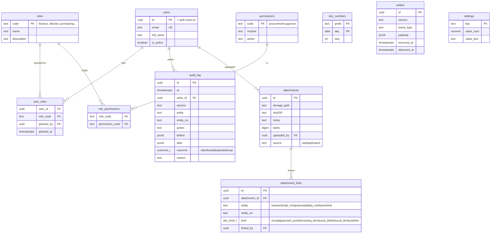

**Access is two separate things** (owner, 2026-09-11, answering Q2 and Q3).
Conflating them is what made "who may post?" invisible to the web app in
`john-lau`, where the button showed for anyone with `finance`, `director` or
`it_admin` and the bridge then returned 403 from an environment variable the
screen could not see (§3.3).

**1. Module access — what you can open.** A user holds *several*:
procurement + accounting + HRD is a normal combination, not an exception.

```sql
core.user_modules (user_id, module, level)
  module ∈ procurement · accounting · hrd · inventory · production · it
  level  ∈ read · write · admin
```

**Ledger visibility is exactly accounting-module access** — not "everyone
signed in", which is what `john-lau` does today.

**2. Authorities — a small set of named decision rights**, granted on their
own and never implied by a module level:

| Authority | Who, today | Guards |
|---|---|---|
| `approve_goods` | **CEO only** | every PR line decision. One authority, not "any director" |
| `approve_funds` | finance | approving and closing a payment round |
| `post_ledger` | finance | creating a transaction |
| `resolve_inbox` | finance | resolving an exception document |

An authority is a grant on a user, so the screen and the database read the
same fact and cannot disagree. A user without `approve_goods` does not see
the approve control **and** is refused by RLS if they call the API anyway.

**A tension that dissolves.** `john-lau` deliberately fused accounting and
procurement into one `finance` role, because "splitting it produces someone
who can approve a purchase without ever seeing the cash" (§6.3). Composable
module grants would bring that risk back — except that `approve_goods` now
belongs to the CEO alone, so the person approving purchases is not a module
grant at all. The safeguard is no longer needed in that shape.

`src/lib/roles.ts` remains the reviewable seed source (see `03-api.md`), but
what it seeds is this: modules, levels, and the authorities — four at D24, five since `approve_overtime` (D145).

### Three trails, and only one of them is expensive to add late

The IT module needs to answer three different questions, and they are not one
table because they fail differently.

| Trail | Answers | Written by | Cost of adding it later |
|---|---|---|---|
| **`core.audit_log`** — changes | who changed what, from what, to what, and was it refused | the same transaction as the change itself | **High.** Not the table — the *seam*. Retrofitting means finding every write path and hoping none was missed |
| **session events** | who was in the system, when, and as whom | the identity service | Low. A handful of call sites, all in one service |
| **`core.activity_events` + `core.activity_daily`** — reads | who *looked at* the ledger, HR records, a salary — and what a person did with their whole day | the request layer, gated; the recap by a nightly roll-up | Low to add. The policy question attached to it is now half answered: retention is set (D188), readership is not — it defaults to `it.read` |

**Only the first has to be early**, and it is early for a reason that is not
about storage: an audit row written *after* the fact is a story, and an audit
row written in the same transaction is evidence. The rule — every mutation
writes its business rows and its audit row together or neither — is in the
definition of done and is enforced today across every write in the demo layer.

**Sessions are recorded from M2**, because a trail that cannot say who was
signed in cannot answer the first question anyone asks it.

**Reads are logged from M34, under the retention the owner set** (Q22, D188).
The third trail is now two tables, because thirty days of detail and six months
of recap are two different lifetimes:

```
core.activity_events                       -- the detail. 30 days.
  id, at timestamptz, user_id, module,
  action text,                             -- view | export | print | search | open
  entity text, entity_id text,
  summary text                             -- what it was, in words, for when the row outlives the thing
  -- retention: deleted past DETAIL_DAYS, and only for a day already rolled up

core.activity_daily                        -- the recap. 6 months.
  day date, user_id,                       -- primary key (day, user_id)
  events int, modules text[],
  changes int, refusals int,               -- taken from core.audit_log, not from the events
  first_at timestamptz, last_at timestamptz,
  headline text,
  rolled_up_at timestamptz
  -- retention: deleted past RECAP_MONTHS
```

`activity_daily` is **the one stored derived figure in this system**, and the
exception is deliberate (D188): its source rows are gone at day 31, so
computing it on read would answer *0 aktivitas* for every day older than a
month — not a missing number, a wrong one. `changes` and `refusals` come from
`audit_log`, which is never purged, so a recap can always be checked against
the trail that outlives it.

**Purging is the only deletion in the schema** (D189). Everything else voids
(D9). It is fenced three ways: it touches `activity_events` only, only past the
retention edge, and only for days that already have a recap row — a day without
one is refused **by name**, never skipped quietly.

**Reads that live in the audit log, not the activity log.** Opening somebody's
identity number is a read, and it is written to `core.audit_log` with
`action = 'reveal'` — because *who looked at my KTP* is asked months later and
the activity log keeps detail for thirty days (D197). Two constraints belong on
it in Phase 2, and both are about what the row must **not** contain:

- the `detail` of a `reveal` row carries whose document and which kind, never
  the number — an audit table nobody may delete from is the worst place to keep
  a national ID;
- `activity_daily.reveals` counts these separately from `changes`, because a
  reveal changes nothing and folding it in would inflate every recap.

**`inv.board_moves`** — what happened to the boards after the saw: `issue`,
`return`, `scrap`, `adjust`, signed, each with the work order or the reason
behind it. **There is no `sawn` row in this table**: the incoming side is
derived from `inv.sawn_boards`, which the yield figures already divide, so the
rack and the rendemen read the same rows and cannot drift (D203). `purchase_id`
is nullable on purpose — it decides what an issue cost, and a load guessed to
fill the column is a wrong number in a costing report (D204).

`inv.log_purchases.nota_attachment_id` links the load to the paper it was
entered from (D201). Nullable only for loads recorded before that rule.

`prod.production_progress` carries **two** columns for who did the work and
they are not redundant (D264). `worked_by` is the name as the mandor wrote it,
kept verbatim for ever, because a record that rewrites itself when somebody is
later linked answers the wrong question in an argument.
`worked_by_employee_id` is the link a **person** made afterwards — the system
suggests and never matches, since matching people by name into a performance
record is how the wrong review lands on the wrong person.
`worked_by_not_a_person` is the third state and it is genuinely third: *Tim
potong* and a vendor's crew are **resolved**, not missing, and they count
towards coverage exactly as a linked name does.

The two are never read raw. `attributionOf()` derives one of three values from
them and everything downstream reads that, so the invariant — never both set —
cannot drift apart in a caller's hands (F75's rule). The API refuses a name
declared both at once rather than preferring one, because either preference
would be the software deciding who did the work.

`prod.design_tasks` carries the same pair, on the same terms: a freelance
drafter is a legitimate answer.

**Schema `dlv`** — the last leg (D209): `deliveries` + `delivery_lines`,
`packing_boxes` + `box_lines`, `installations` + `installation_lines`, `snags`,
`handovers`. Four things about it are load-bearing:

- **nothing stores a quantity delivered or installed.** Both are sums over the
  line tables, filtered by the parent's status — and `delivered` (left the
  yard) and `arrived` (signed for) are **different filters over the same rows**
  (F62);
- `handovers.open_snags_at_handover` and `open_snag_nos` are **stored, not
  derived**, for the same reason `activity_daily` is (D188): the snags will be
  closed, and a derived count would rewrite a signature-with-notes into a clean
  one (D212);
- `handovers.bast_attachment_id` is **NOT NULL**. It is the only evidence
  column in this schema that is, because it is the only one backing a claim
  about what somebody else agreed to (D211).

`dlv.packing_boxes` is what physically leaves the yard, and it exists because a
delivery line and a crate are not the same object: *2 set meja makan* arrives as
four boxes, and a dining table whose top arrived and whose legs did not is worth
nothing (D262). Four columns carry the weight:

- **`destination` is NOT NULL** — where the crate goes *inside the building*.
  It is the one fact `delivery_lines` structurally cannot hold, and it is the
  whole reason the table exists. A box row with a blank destination is a label
  that moves the job of opening the crate to the site;
- **`problem_note` is required to set `status = 'PROBLEM'`**, enforced at the
  API rather than by a constraint, because the check is conditional on a value
  and the message matters more than the rejection. A red flag with nothing
  written on it cannot be acted on by anybody in the workshop;
- **`delivery_id` is nullable.** A box is packed and labelled before anybody
  books a lorry, and that gap is a state the workshop is in every day, not a
  missing foreign key;
- **there is no `position` column.** *3 dari 5* is computed from the
  consignment on read: it changes the moment another box joins the same lorry,
  and a number printed on a label that is no longer true is worse than none.

`box_lines.project_line_id` is nullable for the same reason `dlv` is careful
elsewhere: a box of handles and screws belongs to no line the client ordered by
name, and forcing it onto one would make the fitted count wrong. A consignment
that predates the labels has **no** box rows at all, and that is read as *no
boxes recorded* rather than *nol peti* (F60's rule again).

**Schema `asst`** — `assistant_turns`: the prompt verbatim, what it was
understood as, the tools it ran, the facts it returned, and the draft plus its
outcome. Kept because *what did John Lau tell me on Tuesday* is asked after
somebody has acted on the answer (D217). Two constraints matter:

- a turn's **figures live in their own column**, never inside the prose, so a
  number cannot be paraphrased on its way into a sentence;
- the **tool catalogue is code, not rows.** A list of what an assistant may
  reach is a security boundary, and a boundary stored as data somebody can
  edit at runtime is a boundary with an UPDATE statement in it (D218).

`core.audit_log` has no retention at all. It is the evidence behind every
figure the system prints, and a purged audit row is a past number nobody can
explain.

`core.audit_log` is append-only and has **no** hash chain in v1. §10.2 q8
records that the audit triggers were written and never run because they touch
money write paths; here they are in scope from the start, on the one write
seam only (ADR-006), which is the narrow path they should always have used.

---

## Schema `procure` — reference data, PR chain, PO

### Reference data

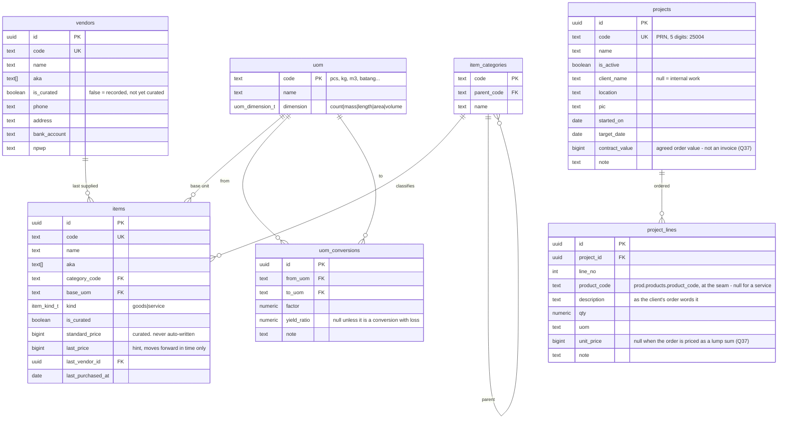

`uom_conversions` exists in v1 **as a table only** — procurement needs
`box → pcs`. The wood yield chain (log m³ → sawn boards at 45–60% → dried →
components with 10–30% offcut, README "what must be designed right from the
start") is the inventory milestone, and it plugs in here rather than needing
a new model. Stock is always stored in an item's `base_uom`.

`is_curated=false` keeps its exact `john-lau` meaning: **recorded, and
invisible in dropdowns and AI prompts until a human promotes it** (§3.7).
A new vendor typed by a human must always be accepted — that was the owner's
call on 2026-08-05 and it stands.

### PR chain

```mermaid
erDiagram
    pr_documents ||--o{ pr_lines : "contains"
    pr_lines ||--o{ pr_approvals : "decided"
    pr_lines ||--o{ pr_line_revisions : "superseded"
    pr_lines ||--o{ receipts : "received"
    vendors ||--o{ pr_lines : "from"
    items ||--o{ pr_lines : "of"
    payment_rounds ||--o{ payment_round_lines : "freezes"
    payment_rounds ||--o{ round_transfers : "funded by"
    pr_lines ||--o{ payment_round_lines : "in"
    pr_lines ||--o{ line_settlements : "short settled"
    pr_lines ||--o{ line_variances : "explained"
    pr_lines ||--o{ line_notes : "annotated"
    pr_lines ||--o{ approval_requests : "asked"
    approval_batches ||--o{ approval_requests : "sent in"

    pr_documents {
        uuid id PK
        text doc_no UK "pr-26-09-10_01"
        pr_doc_type_t doc_type "PR|FUND"
        pr_doc_status_t status "DRAFT|SUBMITTED|APPROVED|CLOSED|CANCELLED"
        uuid requested_by FK
        uuid project_id FK
        text purpose
        timestamptz submitted_at
    }
    pr_lines {
        uuid id PK
        text source_wo_no "the SPK whose BOM produced this line (D151)"
        uuid doc_id FK
        int line_no "-> pr-26-09-10_01-L03"
        text line_no_full UK "generated column"
        uuid item_id FK
        text description "what the requester actually wrote"
        numeric qty
        text uom FK
        bigint unit_price
        bigint item_total "what was ASKED. never zeroed to cancel"
        uuid vendor_id FK
        uuid po_line_id FK "null unless funding a PO"
        text category "RAW MATERIAL|MACHINING|..."
        date need_by
        timestamptz removed_at "withdrawn by the requester"
        uuid removed_by FK
    }
    pr_approvals {
        uuid id PK
        uuid line_id FK
        approval_step_t step "GOODS|FUNDS"
        boolean approved "checked, or not yet"
        numeric approved_qty
        bigint approved_amount "CHECK not above item_total"
        uuid recorded_by FK
        channel_t channel "web|chat|sheet|script|api"
        text reason
        timestamptz recorded_at
    }
    payment_rounds {
        uuid id PK
        text round_no UK "pay-26-09-10_01"
        round_status_t status "OPEN|APPROVED|TRANSFERRED|CLOSED"
        uuid approved_by FK
        bigint transferred_amount
        text transferred_trx_no
        uuid closed_by FK
        timestamptz closed_at
    }
    round_transfers {
        uuid id PK
        uuid round_id FK
        bigint amount
        text trx_no "the ledger row that moved it"
        uuid proof_attachment_id FK "no proof, no transfer"
        uuid recorded_by FK
        timestamptz recorded_at
    }
    payment_round_lines {
        uuid id PK
        uuid round_id FK
        uuid line_id FK
        bigint requested_amount "frozen at APPROVE ROUND"
    }
    receipts {
        uuid id PK
        text receipt_no UK
        uuid line_id FK "exactly one of line_id/po_line_id"
        uuid po_line_id FK
        numeric qty_received
        receipt_condition_t condition
        uuid received_by FK
        uuid qc_by FK
        timestamptz received_at
    }
    line_settlements {
        uuid id PK
        uuid line_id FK
        bigint shortfall
        text reason "NOT NULL. a named human decision"
        uuid decided_by FK
    }
    line_notes {
        uuid id PK
        uuid line_id FK
        text instructions "something to DO"
        text remark "for the record"
        uuid recorded_by FK
        timestamptz recorded_at
    }
    approval_batches {
        uuid id PK
        text batch_no UK "ask-26-09-10_01"
        text token UK "random, never derived"
        uuid sent_to FK
        uuid sent_by FK
        channel_t channel
        timestamptz sent_at
    }
    approval_requests {
        uuid id PK
        uuid batch_id FK
        uuid line_id FK
        text token UK "identifies the REQUEST, never a person"
        uuid sent_to FK "whose yes this is"
        uuid sent_by FK "who chased it"
        channel_t channel "chat"
        timestamptz answered_at
        text outcome "approved|declined|null"
    }
    line_variances {
        uuid id PK
        uuid line_id FK
        variance_reason_t reason "closed list of seven"
        text note "required when reason = other"
        bigint amount_at_time "the gap when it was explained"
        uuid recorded_by FK
        timestamptz recorded_at
    }
```

**`round_transfers` — no proof, no transfer, and rarely only one** (D80, D82).
A round reaches TRANSFERRED on its first instalment and keeps taking more
until it is fully funded; each row carries its own amount, its own ledger row
and its own proof, because each is its own claim about the bank. A single
`transferred_amount` column on the round could hold only the last transfer, or
a total nobody could take apart. "Transferred" is a
claim about the bank, and the sheet's version of that claim was a tick
somebody typed — which is exactly how a round could read funded while the
money was still sitting in the leadership account. The same rule already
governs receiving: no photo, no receipt (A15).

The proof also lives where it belongs, on the transaction that received the
money (`attachment_links`, `entity: transaction`, kind `Payment Proof`), so
the ledger row reads correctly on its own. The round holds the id; the
filename is the documents service's business.

**`evidence_inbox.money_direction` — the second road in** (D81). Almost
everything in that inbox is somebody who bought first: money going OUT. A
transfer proof dropped in chat by leadership is money coming IN, and it is
resolved by a different person for a different reason — booked as a receipt
into BCA 271 rather than matched to a purchase. Confirming one writes the IN
transaction, files the same photo against it, and closes the inbox row with a
pointer to what it produced.

**Document kinds, and which of them count** (D85). Three are *primary* — a
nota, a transfer proof, a photo of what arrived — and one of them is required
before a ledger row can exist. Three are supporting: a delivery note, the PO,
anything else. Supporting is worth filing and never enough on its own: it does
not say that this money moved for this reason.

**`audit_log.detail`** (D84). Who and when was never the hard part. A ledger
entry now records what changed — the amount before and after a void, the
account, the vendor, which documents arrived with the row — because anomaly
and fraud questions are asked about a specific row while looking at it, not
about a month.

**`line_notes` — leadership's two optional fields** (D64). `instructions` is
something the requester is expected to DO; `remark` is for the record. They
are not columns on `pr_approvals` because the moment they earn their keep is
on a line nobody has decided yet: "get another quote before you order this" is
an instruction, and making somebody approve the line before they can say it
would be backwards.

**`approval_requests` — the yes that leaves the room** (D69). A leadership
meeting runs on one laptop, open on whoever's account. Ticking the box there
records that person as the approver, which is false — and false in the one
place the system exists to be trustworthy. So the line is sent to the
approver in Google Chat, and the answer comes back carrying **their**
identity.

Two columns carry the rule. `sent_to` is whose decision it is; `sent_by` is
who chased it, which is a different question worth keeping. `token`
identifies the request and never the person: in Phase 2 the answer arrives as
a signed webhook from Google and the identity is read from that signature, so
a token that carried an identity would be a password anybody who saw the card
could replay.

The resulting `pr_approvals` row reads `chat · evin@talaliving.com · 14:00`,
which is what actually happened.

**Batched, because a meeting is a list** (D70). One send is one
`approval_batches` row and one card, carrying every line in it and three
totals: asked for, approved so far, and what has to be paid — that last one
being approved *minus what already reached those lines*, since approving
something already paid for commits no new money. Fifteen separate cards would
ask the approver to add fifteen numbers up before knowing what they had just
committed to.

`token` is random on both tables and never derived from `batch_no`: it is a
capability the card carries back, so a predictable one would let anybody who
can guess a document number answer somebody else's list.

**`line_variances` — why the money that moved is not the money approved**
(D54, D55). Append-only, like every decision record here: a correction is a new
row beside the old one, never an edit. Three columns carry the weight.

`reason` is an enum of seven and never free text, because the value of this
table is *counting kinds*. `price_changed`, `quantity_changed`, `rounding`,
`input_error`, `partial_payment`, `overpaid`, `other` — and `other` requires
`note`, refused with 422 otherwise.

There is **no `fault` or `blamed_on` column, deliberately.** Whether one
Rp 225.000 gap was a typo or carelessness is not knowable from the data, and a
column that claims to know gets believed. What is knowable is the shape of the
pile: twelve `price_changed` against one vendor, six `input_error` from one
person.

`amount_at_time` freezes the gap as it stood when somebody explained it, so a
later payment on the same line does not silently rewrite what was being
explained.

**The link to `line_settlements`** (D56): an underpayment explained as anything
except `partial_payment` writes a settlement row in the same transaction, with
the explanation as its `reason`. A12 asked for a shortfall to close by a named
human decision — this is that decision, so it is one act.

**Approval is a checkbox** (D28). `pr_approvals` keeps its append-only shape
and its identity columns — a toggle writes a row, so "approved at 14:02, then
un-approved at 14:09" survives — but the vocabulary is two states, not three.
The approved amount is a separate thing from the decision: it defaults to what
was requested and may be **reduced before checking**, never raised (A8).

**Removal, and the one guard it needs** (D29). A line is removed because it is
no longer needed — there is no deadline and nothing ages out. Soft: the row
stays, with `removed_by` and `removed_at`, and a removed line can never be
paid, which is the guarantee `REJECTED` used to carry.

The guard: **a line cannot be removed once money has reached it.** Removal is
for something not yet bought. Once an allocation exists, the right words are
return, vendor credit, or a void on the transaction — never a quiet
disappearance (A17, A18). Removing a line that sits in an `OPEN` round pulls
it out of that round; a round already `APPROVED` has frozen its numbers, so
the line leaves the queue but the round's record does not change.

### PO

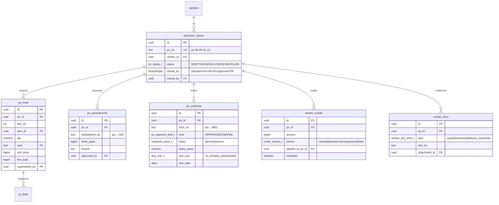

**PO rules held by the schema** (§3.9):

- `contract_value` = Σ non-superseded `po_lines.line_total` — a view, never
  a column.
- A PO is born `DRAFT` and becomes `ISSUED` only when the first PR line
  pointing at it is approved. After that the obligation moves **only** through
  an approved `po_amendments` row.
- One `DP` and one `FINAL` per PO (partial unique index); `PROGRESS`
  unlimited.
- A write-back that would cut a line's qty below what has already been
  received is refused — that is a return/credit decision, not an edit.
- No separate PO approval surface, and no second money path: a PO is funded
  by PR lines that carry its `po_line_id`, and those ride the weekly round.

---

## Schema `acct` — accounts, ledger, allocations, review


Note what is **not** here: no `sheet_ref`, no `push_id`, no `pushes` table, no
`trx_ids` reservation table, no `queue_writes`. All four exist in `john-lau`
only to keep a spreadsheet and a database in step (D1, ADR-006).

Note also what has **shrunk**: the review queue is now `evidence_inbox` and
carries only the exception road (ADR-010). It has no slot naming, no candidate
line picker and no `duplicate_of_event`, because those existed to support a
guess that no longer has to be made.

`statement_lines` is a real table, not `interpretations.output.rows` — §9.3.7
names that JSON blob as the only home statement lines had, which is why they
could not be queried.

`transaction_types.auto_complete` ships **inert** (Q9). Fuel and utility rows
will never receive goods and should be born `COMPLETED`, and `john-lau`
already encodes exactly that — but the owner's call is to complete them by
hand for now and turn the rule on once we have watched which types really
never get a delivery. The column exists so that switch is a data change.

### Rekening koran

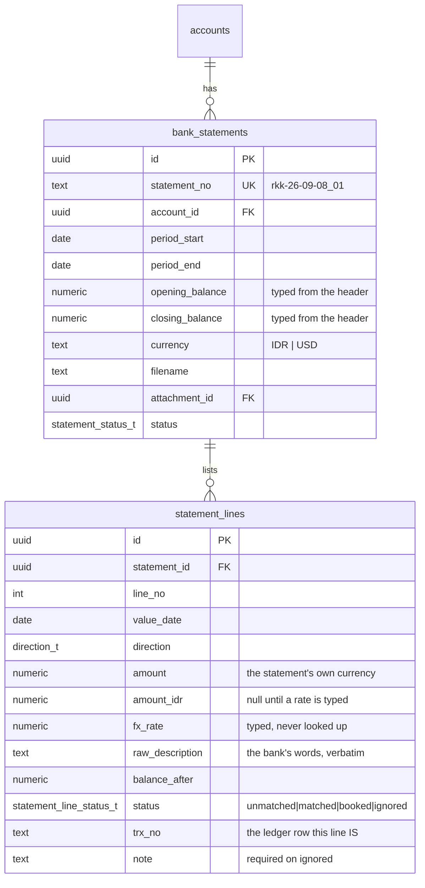

| Constraint | Why |
|---|---|
| `bank_statements` UNIQUE `(account_id, period_start, period_end)` | the same period twice is a re-upload, and booking one movement twice is the most expensive mistake this screen offers (D180) |
| `statement_lines` UNIQUE `(trx_no)` where `trx_no IS NOT NULL` | one movement, one ledger row |
| `statement_lines` CHECK `status = 'booked' → amount_idr IS NOT NULL` | a foreign line reaches the ledger only after somebody types the rate (D181) |
| `statement_lines` CHECK `status = 'ignored' → note IS NOT NULL` | a line nobody can explain is the one somebody will ask about |
| `fx_rate` stored per **line**, not per statement | a month's transfers are not one rate, and averaging them is how a dollar account stops reconciling |

`opening_balance + Σ lines = closing_balance` is **not** a constraint — a
partial file is still worth having. It is computed on read and shown as a
disagreement, because hiding it is the only unacceptable option (D182).

### The payment calendar (new, M12b)

Three small tables, and the reason they are tables rather than a spreadsheet
is that two of them are decisions somebody has to be able to read back.

```sql
create table acct.cash_component (
  id            uuid primary key default gen_random_uuid(),
  name          text not null,
  direction     acct.direction not null,
  -- per occurrence, not per month: a weekly line costs more in a five-payday
  -- month, and one monthly figure could not say that (D113)
  amount_idr    bigint not null check (amount_idr > 0),
  frequency     acct.cash_frequency not null default 'monthly',  -- weekly|monthly|once
  due_day       smallint check (due_day between 1 and 31),
  due_weekday   smallint check (due_weekday between 0 and 6),
  due_date      date,                      -- 'once' only: it exists in that month and no other
  constraint cash_component_when check (
    (frequency = 'monthly' and due_day is not null)
    or (frequency = 'weekly' and due_weekday is not null)
    or (frequency = 'once' and due_date is not null)
  ),
  -- how the plan finds what actually happened; unique so no ledger row is
  -- claimed twice (D110)
  type_code     text references acct.transaction_type(code),
  vendor_id     uuid references procure.vendor(id),
  account_id    uuid references acct.account(id),
  starts_on     char(7) not null,          -- YYYY-MM
  ends_on       char(7),
  note          text,
  active        boolean not null default true,
  created_by    uuid not null references core.app_user(id),
  created_at    timestamptz not null default now()
);
-- only *standing* lines are exclusive on a category. A one-off may share one:
-- being dated, it claims its own payment first, which is exactly what
-- "pelunasan kartu kredit, bukan cicilan" is (D113)
create unique index cash_component_category_uq
  on acct.cash_component (type_code, coalesce(vendor_id, '00000000-0000-0000-0000-000000000000'::uuid))
  where active and type_code is not null and frequency <> 'once';

create table acct.cash_override (          -- one month that differs (D109)
  id            uuid primary key default gen_random_uuid(),
  component_id  uuid not null references acct.cash_component(id),
  month         char(7) not null,
  amount_idr    bigint,                    -- null = not this month
  due_day       smallint check (due_day between 1 and 31),
  reason        text not null,             -- required, always
  recorded_by   uuid not null references core.app_user(id),
  recorded_at   timestamptz not null default now(),
  unique (component_id, month)
);

create table acct.cash_settlement (        -- "that row was this bill"
  id            uuid primary key default gen_random_uuid(),
  component_id  uuid not null references acct.cash_component(id),
  month         char(7) not null,
  trx_id        uuid not null unique references acct.transaction(id),
  recorded_by   uuid not null references core.app_user(id),
  recorded_at   timestamptz not null default now()
);
```

`due_day` is a day, not a date, because the thing being described repeats. The
view clamps it: the 31st of a 30-day month is the 30th, since a reminder needs
a date that exists. A weekly line has no day at all — it has a weekday, and the
view generates four or five occurrences depending on the month.

An override on a weekly line is **the month's total**, and the view puts the
difference on the last run: the THR is paid with one payday, not spread across
four (D114).

What is **not** here: a `cash_plan` table. The plan is `v_cash_plan`, computed
from these three plus the ledger, because a stored projection is a number that
disagrees with the ledger the moment anybody posts (A3).

The gap this schema exposes is in `procure.po_schedule`: its terms fire on an
event (`on_issue`, `on_delivery`), so Rp 156.892.000 of real supplier
obligations carry no date and no month can hold them (F30). Phase 2 adds
`expected_date` there — the date we *think* it lands, distinct from the rule
that makes it due.

---

## Schema `hr` — people, taps, marks, payroll

A sixth service (D136). Not part of `core`: identity says who may open a
screen, HR says what somebody is owed, and payroll is both the most
access-controlled data in the company and the most likely to need its own
retention rule.

```mermaid
erDiagram
    employees ||--o{ attendance_scans : "tapped"
    employees ||--o{ day_marks : "marked for"
    employees ||--o{ allowance_withholdings : "lost a day of it"
    employees ||--o{ enrolments : "registered in"
    employees ||--o{ tasks : "asked to do"
    employees ||--o{ overtime_lines : "worked"
    overtime_sheets ||--o{ overtime_lines : "lists"
    attendance_imports ||--o{ attendance_scans : "brought in"
    payroll_runs ||--o{ payroll_lines : "computed (view)"

    employees {
        uuid id PK
        text employee_no UK "B-009 - the number on the reader"
        text full_name
        text position
        text unit
        pay_basis_t pay_basis "monthly|daily|hourly"
        bigint base_rate "POKOK only - per month, day or hour"
        bigint allowance_rate "TUNJANGAN - per day present, whatever the basis (D250)"
        numeric daily_hours "standard day"
        date joined_on
        int paid_leave_days "per person - the owner was explicit"
        boolean active
        date left_on "records stay (A5)"
        text note
    }
    tasks {
        uuid id PK
        text task_no UK "tgs-26-09-13_01"
        text title
        uuid assignee_id FK "a REAL employee link; production links beside the name instead (D264)"
        uuid assigned_by FK
        date due_date "required - a task that cannot be late is one nobody can tell is late"
        task_ref_t ref_kind "none|work_order|project|purchase_request"
        text ref_no "public code, validated at the seam"
        task_status_t status "OPEN|DONE|CANCELLED"
        timestamptz done_at
        text blocked_reason "set = out of the assignee's score entirely (D261)"
        text cancelled_reason
    }
    contribution_rates {
        uuid id PK
        contribution_scheme_t scheme "BPJS_KESEHATAN|JHT|JP|JKK|JKM|PPH21"
        date effective_from "dated like the pay rules (D173)"
        numeric employer_percent
        numeric employee_percent
        bigint wage_ceiling "NULL = none. BPJS resets these annually"
        boolean confirmed "false = a stand-in this system chose, not a checked figure (Q49)"
        text note "where the number comes from - required"
    }
    enrolments {
        uuid id PK
        uuid employee_id FK
        contribution_scheme_t scheme
        text member_no "masked on read (D196)"
        date enrolled_on
        date ended_on "NULL = still covered. The row NEVER goes (A5)"
        text ended_reason "required - read when the name is still on next month's bill"
        bigint declared_base "the wage BPJS was registered against, where it differs"
        uuid by FK
    }
    allowance_withholdings {
        uuid id PK
        uuid employee_id FK
        date work_date
        text reason "NOT NULL - a deduction with no sentence is unarguable (D155)"
        uuid by FK
        timestamptz at
        uuid restored_by FK "nullable - putting it back is a second decision, not an erasure"
        timestamptz restored_at
        text restored_reason
    }
    attendance_imports {
        uuid id PK
        text filename
        int rows_seen
        int rows_added
        int rows_duplicate
        jsonb unknown_refs "machine numbers nobody is registered under"
        uuid imported_by FK
        timestamptz imported_at
    }
    attendance_scans {
        uuid id PK
        uuid employee_id FK
        date work_date "office day, WITA"
        timestamptz at
        text verify "FACE|FP - carried verbatim"
        text location
        scan_source_t source "import|manual"
        uuid import_id FK
        text reason "required when source = manual"
        uuid recorded_by FK
        timestamptz recorded_at
    }
    day_marks {
        uuid id PK
        uuid employee_id FK "NULL = the whole office"
        date work_date
        day_mark_t kind "holiday|half_day|absent|sick|leave|permit"
        text reason "NOT NULL"
        uuid marked_by FK
        timestamptz marked_at
    }
    overtime_sheets {
        uuid id PK
        text sheet_no UK "lbr-26-08-31_01"
        overtime_kind_t kind "production|staff"
        date work_date "one sheet, one night"
        text purpose
        uuid hrd_checked_by FK
        timestamptz hrd_checked_at
        uuid leader_approved_by FK "production only"
        timestamptz leader_approved_at
        boolean paid "staff: default TRUE"
        text unpaid_reason
        uuid declined_by FK
        text declined_reason
    }
    overtime_lines {
        uuid id PK
        uuid sheet_id FK
        uuid employee_id FK
        numeric hours
        text task
        text wo_no "production: the work order, at the seam"
        text stage
        numeric qty_done
        numeric form_amount "the GAJI column of the paper form (D154)"
    }
    payroll_runs {
        uuid id PK
        text run_no UK "pyr-26-09-11_01"
        date period_start
        date period_end
        payroll_status_t status "DRAFT|APPROVED|PAID"
        uuid approved_by FK
        text paid_trx_no "the ledger row that paid it"
        text note
    }
    payroll_adjustments {
        uuid id PK
        text run_no FK "belongs to the run, not to the week"
        uuid employee_id FK
        adjustment_kind_t kind "late|sp|carry_over|advance|bonus|other"
        numeric amount "signed: negative takes money off"
        text reason "printed on the payslip, verbatim"
        uuid created_by FK
        timestamptz created_at
    }
```

**`attendance_scans` is one row per tap, not one per day** (D141). The real
export is a stream of moments — four on a good day, six with lembur, and 48
days out of 227 that are neither (F40). A `check_in`/`check_out` pair cannot
hold that file without discarding the rows somebody has to look at. The six
slots are computed, never stored.

| Constraint | Why |
|---|---|
| `attendance_scans` UNIQUE `(employee_id, at)` | re-uploading the same export is a no-op. A tap is who and when, to the second (D143) |
| `attendance_scans` CHECK `source = 'manual' → reason IS NOT NULL` | a time somebody typed says why the machine missed it (D137) |
| `day_marks` UNIQUE `(work_date, employee_id)` incl. NULL | one mark per person per day, one office-wide mark per day. Postgres needs `NULLS NOT DISTINCT` here |
| `day_marks.reason` NOT NULL | *setengah hari* with no reason is a decision nobody can check in six months (D142) |
| `overtime_lines` UNIQUE `(sheet_id, employee_id)` | one line per person per sheet — a second entry for the same night is a second sheet |
| `overtime_sheets` CHECK `leader_approved_at IS NULL OR hrd_checked_at IS NOT NULL` | leadership signs **after** HRD, not instead of it (D145) |
| `overtime_sheets` CHECK `kind = 'staff' → leader_approved_at IS NULL` | a staff session never waits on leadership (D146) |
| `overtime_sheets` CHECK `paid OR unpaid_reason IS NOT NULL` | turning off a default-paid session says why |
| `overtime_lines` CHECK `wo_no IS NULL OR (stage IS NOT NULL)` | a production line names the stage it advanced (D147) |
| `employees.paid_leave_days` NOT NULL, default 0 | per person, because length of service and what was agreed at hiring both move it (D144) |
| `employees` no DELETE | a payslip from March is still a fact in June (A5). `left_on` retires somebody |
| `payroll_runs` UNIQUE `(period_start, period_end)` | the same week is not run twice by accident |
| `payroll_adjustments.reason` NOT NULL, non-empty | a deduction an employee cannot read is one they cannot dispute (D155) |
| `payroll_adjustments` CHECK `amount <> 0` | a zero adjustment is a row that says nothing and prints a line on a payslip |
| `payroll_adjustments` writable only while the run is `DRAFT` | an approved run is a figure somebody signed; moving money inside it afterwards is a new run, not an edit (D155) |
| `overtime_lines.form_amount` NULL-able | most nights have no figure on the paper; a nought there would mean *worked for free* rather than *not stated* (D154) |

### Berkas 201 and leave

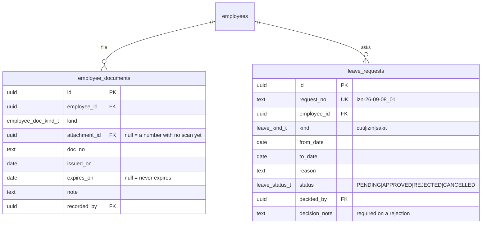

| Constraint | Why |
|---|---|
| `employee_documents` CHECK `attachment_id IS NOT NULL OR doc_no IS NOT NULL` | one line with neither is not a document (D177) |
| `employee_documents` CHECK `expires_on IS NULL OR expires_on >= issued_on` | |
| the checklist itself is **code**, not rows | adding a required kind makes every incomplete file say so the same day, with nothing to back-fill |
| `leave_requests` CHECK `status = 'REJECTED' → decision_note IS NOT NULL` | a refusal an employee cannot read is one they cannot argue with (A7) |
| no overlapping PENDING/APPROVED range per employee | the same days asked for twice is a mistake, not a second request |
| approval writes `day_marks`, skipping days that already have one | a public holiday inside somebody's leave is still a public holiday (D178) |

The balance is **not a table**. Entitlement minus days marked minus days
approved-and-not-yet-taken, computed on read (A3) — a stored balance is the one
that drifts from the marks behind it.

### The rule book

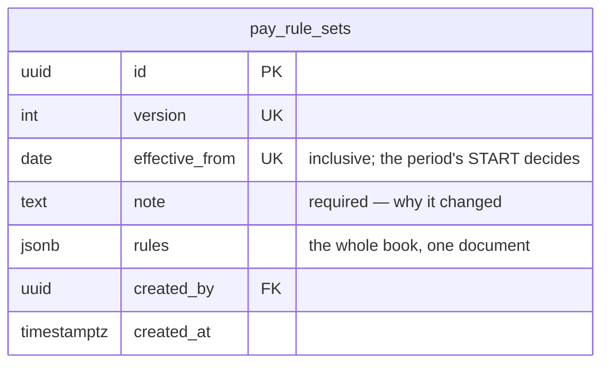

The rules themselves are `jsonb` rather than forty columns, deliberately: the
shape changes when a policy gains a step (a third overtime tier, a second grace
window), and a schema migration per policy tweak is exactly the deployment this
model exists to avoid (D173). What is **not** flexible is the versioning — a
row is never updated, and a payslip is computed under the version in force when
its period opened.

| Constraint | Why |
|---|---|
| `pay_rule_sets` no UPDATE, no DELETE | a payslip from March must stay recomputable under March's rule (D173) |
| `effective_from` must be `>= current_date` | days already worked were worked under a rule somebody could have read at the time |
| `effective_from` not inside an existing run's period | the payroll picks the rule in force when the period **opened**, so a mid-period version would look applied and do nothing |
| `note` NOT NULL, non-empty | a pay rule that changed without a sentence is one nobody can explain to the person whose wage moved |

### What makes a marked day paid

Two of the six marks can be worth money, and both depend on something outside
the mark itself (D144):

- **`sick`** is paid when a `Surat Dokter` is linked to the mark in
  `core.attachment_links` — evidence on the same road as every nota and every
  receiving photo (ADR-010). The letter may arrive days later; the day turns
  paid the moment it does, with **no re-run and no correction**, because the
  value was never stored.
- **`leave`** is paid out of `employees.paid_leave_days`, and what has been
  used is **counted from the marks in that calendar year**, in date order — the
  first days of the entitlement are the paid ones. There is deliberately no
  `leave_balance_remaining` column: a stored balance drifts the first time a
  mark is removed, and the person it drifts against loses a paid day (A3).

Everything else — `permit`, `absent`, `leave` past the entitlement, `sick`
without a letter — is recorded and not paid, and the timesheet says so in
words. Q33 is answered; nothing here refuses a mark, because a day taken
without a letter is still a fact about that person's month.

Overtime has **two shapes**, because the paper does (D146). A *production*
sheet is paid when both `hrd_checked_at` and `leader_approved_at` are set, and
the second is refused until a `Surat Lembur` is linked to the sheet. A *staff*
sheet is paid on `paid`, which ships `true`: HRD's decision is whether to turn
it off, and doing so writes `unpaid_reason`. Its evidence is a
`Laporan Lembur` — the screenshot of the work.

Marks never touch scans, and scans never override a mark. They are different
kinds of statement: the taps are evidence with a machine behind them, the mark
is a decision with a person behind it, and destroying either to express the
other loses the only record of what happened (D142).

### Views

| View | Answers |
|---|---|
| `v_timesheet_day` | per employee per office day: the taps, the six slots the rule filled, `work_hours`, `break_hours`, `overtime_hours`, `day_value` (1 / 0,5 / 0) and `state` — `complete` · `review` · `marked` · `off` |
| `v_payroll_line` | per employee per run: days worked broken into **present · sakit paid · cuti paid · unpaid**, days still unread, normal hours, **twice-approved** overtime hours, base pay, overtime pay, gross. Computed on read, never stored (D139) |
| `v_overtime_stage` | per claim: `waiting_hrd` · `waiting_surat` · `waiting_leader` · `approved` · `declined`, derived from the two signatures and the linked letter — never a status column beside them (D145) |
| `v_leave_used` | per employee per year: paid leave days taken, from the marks. The balance is `paid_leave_days − this` (D144) |
| `v_payroll_run` | the run plus `gross_total`, `open_days`, `pending_overtime_hours` |

`day_value` is where the marks reach the money: 1 for an ordinary day, 0,5 for
*setengah hari*, 1 for *sakit* with the letter and *cuti* inside the balance,
0 for everything else, and on a *tanggal merah* the hours worked become
overtime while the day itself counts nothing (D142, D144).

Approving a run is refused while `open_days > 0`: a payroll over days nobody
finished reading is wrong about the people paid by the day, who are least able
to argue (D139).

---

## Schema `mkt` — the Package programme

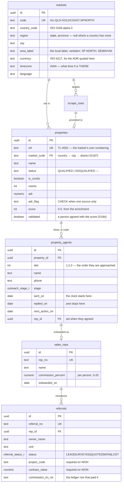

**`move_on` is not a column.** Seven days of silence since `sent_on` is a
predicate, computed on read (D183) — the sheet's own MOVE ON column is one
somebody has to maintain, and a column somebody has to maintain is wrong by
Friday.

| Constraint | Why |
|---|---|
| `property_agents` UNIQUE `(property_id, slot)` | three agents, in a fixed order |
| `property_agents` CHECK `stage = 'DEAL' → rep_id IS NOT NULL` | a deal against nobody is a commission nobody can compute (D185) |
| `sales_reps` CHECK `commission_percent > 0 AND <= 20` | a number that will be paid many times |
| `referrals` CHECK `status = 'WON' → project_code IS NOT NULL AND contract_value IS NOT NULL` | commission comes from a contract that exists, never from a quotation (D186) |
| `scrape_rows` UNIQUE `(market_code, lower(name))` | re-importing the scrape adds nothing |
| `markets.code` is `COUNTRY[-REGION]-CITY-AREA` | every filter is a **prefix** of it, so one query serves country, city and district (D187) |
| no figure mixes two `markets.currency` values | an ADR of 106 and one of 1.850.000 are not addable, and no rate is invented to make them so (D181) |

## Schema `prod` — work orders, stages, progress

A seventh service (D148). The overtime sheet demanded it: each production line
carries *item apa, proses sampai mana, berapa*, and those are production facts
travelling on a payroll document. Written down twice, the two copies begin to
disagree.

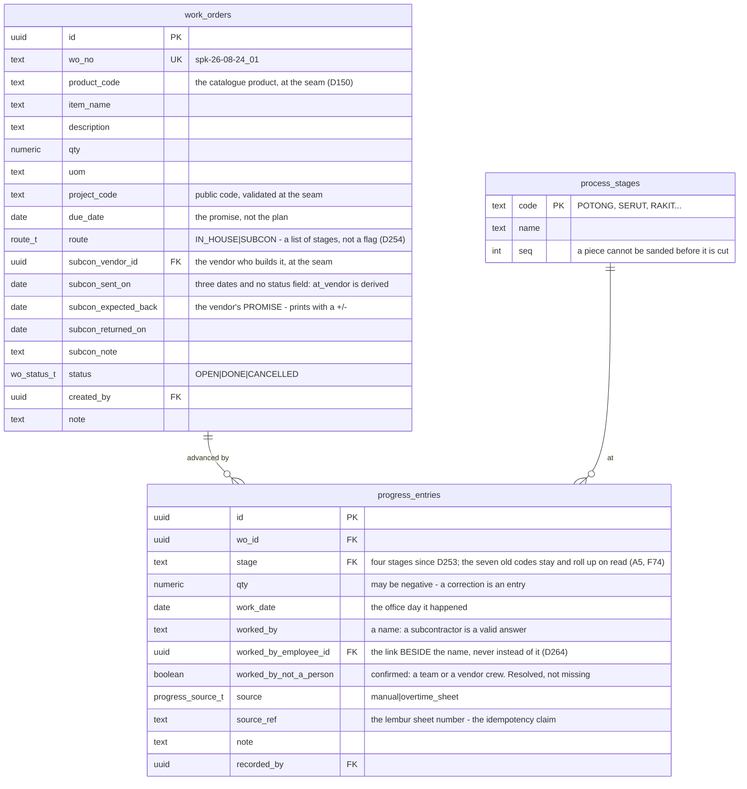

| Constraint | Why |
|---|---|
| `progress_entries` no UPDATE, no DELETE | append-only. "How many were finished on Thursday" is asked after the argument starts (A5) |
| `progress_entries` CHECK `qty <> 0` and `qty < 0 → note IS NOT NULL` | a correction says why; a negative number with no sentence is worse than the wrong one |
| `progress_entries` UNIQUE `(source_ref, wo_id, stage) WHERE source_ref IS NOT NULL` | a signed lembur sheet posted twice adds nothing (D147) |
| `work_orders.due_date` NOT NULL | an order with no date cannot be late, so nobody can tell when it is |
| `process_stages` seeded, not typed | every screen says the same thing, and the order is checkable (Q35) |

**Refused vs warned.** More than the order's quantity at one stage is refused —
it cannot be true. A stage running *ahead of the one before it* is warned about
on the board and accepted: it usually means a mis-keyed number or work that
skipped a step, and refusing the report would only mean the work goes
unrecorded (A6). The demo carries one on purpose — twelve doors, seven
finished, four sanded.

### Master data: products and bills of material

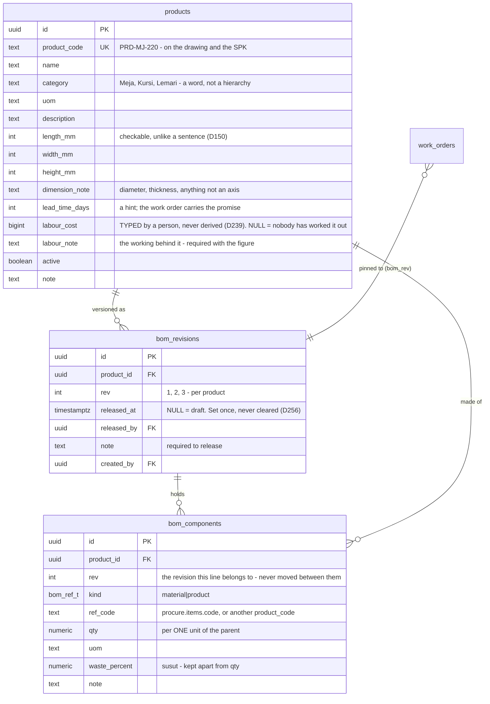

**Why products are not `procure.items`** (D149). Those are things we *buy*, and
half of them are uncurated by design, because a purchase can name something
nobody has catalogued. A product is the opposite: quoted to a client, put on a
work order, made. It exists before anything references it and is always
curated. The two meet in `bom_components`, which points at an item **by code**,
at the seam — never a foreign key across services (ADR-004).

**Why waste is its own column.** `qty` is what the drawing says goes in;
`qty × (1 + waste_percent/100)` is what has to be bought. They are different
numbers and a workshop that conflates them runs out on a Saturday.

| Constraint | Why |
|---|---|
| `bom_components` UNIQUE `(product_id, ref_code)` | one line per component — change the quantity, don't add a second row |
| `bom_components` CHECK `qty > 0`, `waste_percent BETWEEN 0 AND 90` | |
| `bom_components` CHECK `NOT (kind = 'product' AND ref_code = parent code)` | a product cannot be a component of itself |
| `ref_code` **not** a foreign key | the workshop knows it needs a steel frame before procurement has a code for one. Unresolved codes are shown, not refused (A6) |
| `products.product_code` set once | it is on the drawing, the work order and every BOM that references it |
| drawings live in `core.attachment_links` | `Gambar Kerja` and `Gambar Jadi` linked to `entity = 'product'`. A revision is a **new file** against the same product — newest is shown, the old one stays, because a piece built last month was built from it (A5, D150) |

### Views

| View | Answers |
|---|---|
| `v_project_cost` | per project: **projected** material cost (BOM × ordered qty), **asked · approved · paid** over the request lines whose `source_wo_no` belongs to that project's work orders, and separately the ledger's whole project spend. Materials against materials; labour is in neither, and the wider ledger figure is never subtracted from the narrower one (D151) |
| `v_product_bom` | per product: each component resolved to a name and a price — the catalogue's **standard price**, falling back to the **last price paid**, and the view says which — plus `qty_with_waste`, a subtotal, the material cost per unit, and how many components could not be priced. Computed on read, never stored (A3, D149) |
| `v_work_order` | per order: `done` per stage, `current_stage` (the furthest with anything finished), `completed` (through the last stage), `percent` — counted as **stages finished across the quantity**, not as the furthest stage reached — `days_left`, `late`, and the warnings in words |

Who may write: `production.update` for the workshop's own reports, and
`approve_overtime` for entries whose `source` is `overtime_sheet` — because
that posting is the consequence of a signature, and the signature is its
authority (D147).

---

## Schema `inv` — stock

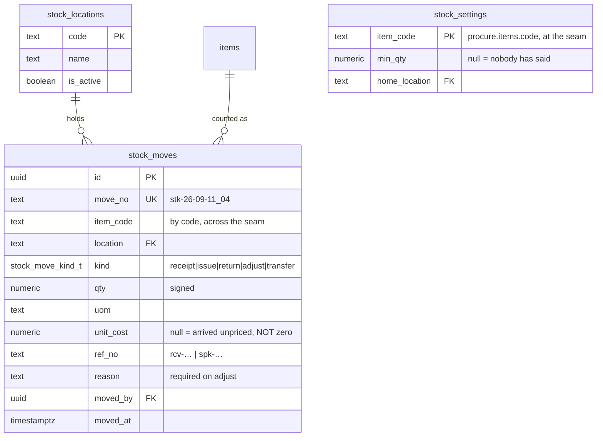

**There is no quantity column anywhere.** On-hand is `sum(qty)` over the moves,
per item and per location, computed on read (A3, D170). The failure this avoids
is the one the spreadsheet already has: a stored quantity that disagrees with
its own history, discovered by somebody standing in front of an empty rack.

| Constraint | Why |
|---|---|
| `stock_moves` no UPDATE, no DELETE | a mistake is another move with a reason (A5, D171) |
| `stock_moves` CHECK `kind = 'adjust' → reason IS NOT NULL` | the sentence *is* the record; "adjustment" alone is a shrug |
| `stock_moves` CHECK `qty <> 0` | a zero move says nothing and clutters the one history somebody reads |
| `stock_moves` UNIQUE `(ref_no, item_code)` where `kind = 'receipt'` | confirming the same delivery twice stocks it once (D170) |
| `stock_moves.unit_cost` NULL-able | unpriced stock is counted and left out of the valuation, never valued at nought (D172) |
| `stock_settings.min_qty` NULL-able | an unstated minimum is not a satisfied one; the screen says *belum ditetapkan* |
| a transfer writes **two** rows | so each location's own history reads correctly on its own |

**Issues are not valued.** What stock cost on the way out — FIFO, average,
standard — is three different numbers and nobody has chosen (Q43). The rack is
valued at the weighted average of what is on it, which is the question being
asked today.

## Schema `inv` — timber

An eighth service (D153), and the narrowest one: it exists because **a cubic
metre of log is not a cubic metre of wood**, and every figure the business
needs about timber lives in the gap between them.

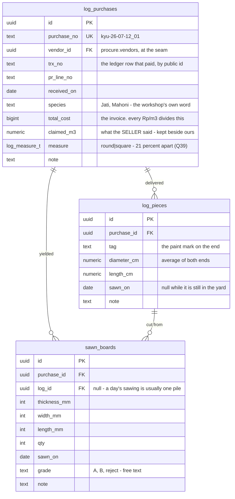

| Constraint | Why |
|---|---|
| `log_purchases.total_cost` NOT NULL, > 0 | without it there is no price per m³, which is the only reason the record exists |
| `log_pieces` UNIQUE `(purchase_id, tag)` | the paint mark identifies the stick |
| `sawn_boards` CHECK every dimension > 0 and `qty` > 0 | |
| `claimed_m3` never overwritten by our measurement | the difference between the two is the conversation with the vendor; keeping one number loses the argument (D153) |

### Views

| View | Answers |
|---|---|
| `v_log_purchase` | per load: `log_m3` (π/4 × d² × L, or d² × L where the purchase says `square`), `sawn_m3`, `unsawn_m3`, `yield_percent`, `cost_per_log_m3`, `cost_per_sawn_m3`, the gap against `claimed_m3`, and the warnings in words |
| `v_timber_by_vendor` | per vendor **and species**: the same figures summed. `cost_per_sawn_m3` is the column that decides a supplier |

Two rules in those views carry all the weight:

**Yield and `cost_per_sawn_m3` are computed over the logs actually sawn**, and
over their share of the invoice. A load with three of five logs cut would
otherwise read as 39% yield when the sawyer is getting 61%, and its wood would
price half again too high.

**Vendors are compared within one species.** One vendor's mahoni against
another's jati is two different woods; averaging them per vendor makes whoever
sells the cheaper species look like the better supplier of the dearer one.

---

## Evidence: the main road and the exception road

ADR-010 inverts how a document reaches the system, and the schema has to make
the normal case the cheap one.

**The main road — `core.attachment_links`.** Somebody opens a PR line or a
ledger row and attaches a file there. One insert into `core.attachments`, one
into `core.attachment_links` naming the entity, done. No queue, no extraction
step standing between the upload and the link, no status to resolve.

The link table is **many-to-many from the first migration**, not as a fix:

- one receipt covering three ledger rows is three link rows, added by
  attaching from the first and then choosing *also covers…*
- one ledger row carrying a receipt, a payment proof and a receiving photo is
  three link rows with different `kind`
- a document is never *moved* from one parent to another — a wrong link is
  removed and a right one added, and both are in the audit log

This is what makes tracing work: every link row records **who** declared it
and **when**, which the old model could not, because the linkage was inferred
rather than stated.

**The exception road — `acct.evidence_inbox`.** A document whose parent is
genuinely unknown: bought first, approved later. It arrives from Chat (the
buyer has no web access) or from the web, gets an AI reading as a *proposal*,
and waits for a person to resolve it into one of: a new transaction, a
retroactive PR line, a link to something that already exists, a personal note
(`Others`), or a rejection. Nothing is ever discarded (A16).

`origin` records which door it came through, so `v_inbox_health` can answer
the question that matters: is the exception road being used as an exception,
or as a way around the normal one?

**What the AI is for now.** On the main road it verifies rather than
classifies: the vendor, the expected amount and the parent are already known,
so the only question is whether the document agrees. It disagrees → an
advisory warning (A6), never a block. On the exception road it does what it
does today — proposes, and never posts.

---

## Views — the only place derived state lives

| View | Schema | Answers |
|---|---|---|
| `v_account_balance` | acct | balance per account = opening + Σ IN − Σ OUT, excluding VOID. **The database owns the number** (D9) |
| `v_transaction_complete` | acct | is the evidence chain complete for this row |
| `v_allocations_public` | acct | the published seam procurement reads (ADR-004) |
| `v_pr_line_coverage` | procure | `approved` = coalesce(approved_amount, item_total, 0); `covered` = Σ non-superseded allocations; `remaining`; `settled`. Tolerance from `core.settings` |
| `v_pr_line_status` | procure | the **one** ladder, resolved in order: DRAFT → REMOVED → COMPLETED → PARTIAL → PAID → APPROVED → WAITING FOR APPROVAL. Seven values, down from nine: `HELD` and `REJECTED` collapse into "not checked" and "removed" (D28), and `WAITING FOR PAYMENT` merges into `APPROVED` because it claimed the cash was reserved for that line and it never was (D126) |
| `v_po_status` | procure | `contract_value`, `paid_to_date`, `outstanding`, `value_received`, **`exposure` = paid − received**, and the two independent axes |
| `v_po_line_status` | procure | per-line delivery and payment |
| `v_round_summary` | procure | REQUESTED, paying-account balance, TO TRANSFER, remaining after payment |
| `v_approval_queue` | procure | **every requested line that is neither approved nor removed** (Q4). A `HOLD` does not leave the queue; only an approval, a rejection or a withdrawal does |
| `v_unlinked_transactions` | acct | money with no PR line — shown, never hidden |
| `v_inbox_health` | acct | how many context-free documents arrived this week, and how many are still unresolved. The exception road should stay small (ADR-010) |
| `v_meeting_board` | procure | the four states: lunas · disetujui belum bayar · dibayar belum disetujui · belum keduanya |

`v_pr_line_status` is carried over rather than redesigned. It encodes
decisions that cost real incidents: **PAID requires that the transaction
exists**, not that a field is filled ("a stamp pointing at nothing is not
paid"); a round marked TRANSFERRED does not make a line PAID ("send money ≠
payment"); a line with no qty (a service, a bill) completes on one GOOD
report.

---

## RLS sketch

```sql
alter table procure.pr_lines enable row level security;

create policy pr_lines_read on procure.pr_lines for select
  to authenticated using (core.has_permission('procurement.read'));

create policy pr_lines_write on procure.pr_lines for insert
  to authenticated with check (core.has_permission('procurement.create'));

-- no update policy: lines are revised by superseding, through the service
-- no delete policy, and DELETE is not granted (A2, A5)
```

Approval tables get a policy that also checks the step:
`core.has_permission('procurement.approve')` for `GOODS`,
`procurement.approve_funds` for `FUNDS`. This is the answer to §3.3's finding
that "nothing in `apps/ops` checks who may post" — a user without the
permission sees a 403 from Postgres, not from a Python bridge that may or may
not have received the right environment variable.

## Migration order (Phase 2)

```
0001_core_types.sql          enums used across schemas
0002_core_identity.sql       users, roles, permissions, user_roles + RLS + has_permission()
0003_core_audit.sql          audit_log, outbox, settings + RLS
0004_core_numbers.sql        doc_numbers + next_doc_number()
0005_core_files.sql          attachments, attachment_links + RLS + storage bucket
0006_procure_reference.sql   vendors, uom, uom_conversions, categories, items, projects + RLS
0007_procure_pr.sql          pr_documents, pr_lines, revisions, approvals + RLS
0008_procure_rounds.sql      payment_rounds, round_lines, settlements + RLS
0009_procure_po.sql          purchase_orders, po_lines, amendments, schedule, credits, docs + RLS
0010_procure_receipts.sql    receipts + RLS
0011_acct_accounts.sql       accounts, transaction_types, + RLS + seed the five accounts
0012_acct_ledger.sql         transactions, transaction_lines, transaction_docs + RLS
0013_acct_allocations.sql    payment_allocations + v_allocations_public + grants
0014_acct_review.sql         review_queue, bank_statements, statement_lines + RLS
0015_hr_people.sql           employees + RLS
0016_hr_attendance.sql       attendance_imports, attendance_scans, day_marks + RLS
0017_hr_payroll.sql          overtime_claims, payroll_runs + RLS
0018_inv_timber.sql          log_purchases, log_pieces, sawn_boards + RLS
0019_prod_master.sql         products, bom_components + RLS
0020_prod_orders.sql         process_stages (seed), work_orders + RLS
0021_prod_progress.sql       progress_entries + RLS
0022_views.sql               every v_* above
0023_seams.sql               post_transaction(), allocate_payment(), audit triggers on those two only
```

Additive migrations may be applied by the agent after a dry run. **Destructive
DDL asks first** — carried over from the `CLAUDE.md` convention that has held
since 2026-07-21.
